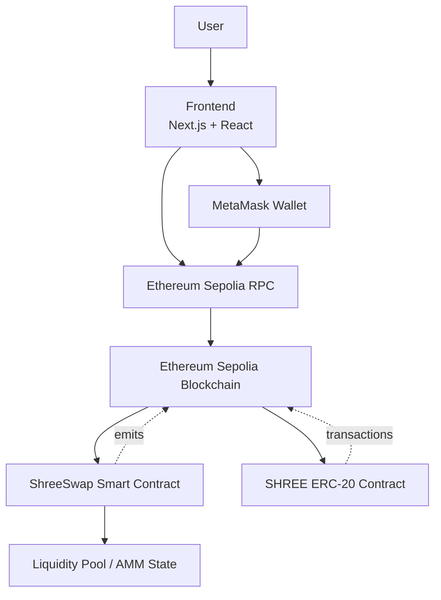

# SHREE SWAP

SHREE SWAP is a decentralized token exchange application built around an Ethereum Sepolia-based automated market maker architecture.

## Overview

SHREE SWAP provides a seamless, non-custodial interface for users to trade SHREE tokens and ETH directly from their wallets. The protocol utilizes a Constant Product Automated Market Maker (AMM) model to ensure liquidity and decentralized pricing without relying on traditional order books.

## Key Features

- **MetaMask wallet integration**: Secure connection and transaction signing via MetaMask.
- **Ethereum Sepolia support**: Fully deployed and operating on the Ethereum Sepolia testnet.
- **SHREE ERC-20 token**: Native custom ERC-20 integration.
- **Token swapping**: Direct swapping between ETH and SHREE.
- **Liquidity pool**: Permissionless liquidity provision with LP token shares.
- **AMM-based pricing**: Deterministic algorithmic pricing based on reserve ratios.
- **Transaction tracking**: Real-time transaction state updates and Etherscan linking.
- **Recent swap history**: Fetching and displaying recent on-chain swap events.

## Technology Stack

### Frontend
- Next.js (App Router)
- React
- TypeScript
- Tailwind CSS
- ethers.js v6

### Backend
- *Note: A dedicated backend server is not currently required. Future implementations for off-chain indexing or analytics will reside in the `backend/` directory.*

### Blockchain
- Solidity (^0.8.24)
- Hardhat
- OpenZeppelin Contracts
- Ethereum Sepolia testnet
- ethers.js (Client integration)

## System Architecture



## Application Flow

1. **Connection**: User connects MetaMask to the frontend. The application strictly manages connections to prevent duplicate `eth_requestAccounts` prompts.
2. **State Sync**: The frontend detects the active wallet and network, connecting to the Sepolia RPC to read contract reserves, user balances, and swap history.
3. **Swap Input**: User enters swap parameters. The UI instantly calculates expected output based on the AMM mathematical formula.
4. **Approval**: If trading SHREE for ETH, the application prompts the user to approve the ShreeSwap contract to spend their SHREE tokens.
5. **Execution**: The user submits the swap transaction via MetaMask. 
6. **Processing**: Ethereum Sepolia processes the transaction, adjusting the pool reserves and transferring assets.
7. **Confirmation**: The frontend waits for confirmation, updates user balances, and appends the transaction to the recent swap history.

## Smart Contract Architecture

### `SHREE.sol`
- **Purpose**: Implementation of the standard ERC-20 protocol for the SHREE token.
- **Details**: Standard OpenZeppelin ERC20 implementation with an initial mint to the deployer.

### `ShreeSwap.sol`
- **Purpose**: The core Decentralized Exchange and Liquidity Pool contract.
- **Main functions**: 
  - `addLiquidity`: Deposit SHREE and ETH to mint LP shares.
  - `removeLiquidity`: Burn LP shares to withdraw SHREE and ETH.
  - `swapSHForETH` & `swapETHForSH`: Execute trades between assets.
  - `getOutputAmount`: View function calculating swap output based on reserves and fees.
- **Important state variables**: `shreeToken`, `totalLiquidity`, `liquidity` (mapping), `FEE_PERCENT` (3).
- **Events**: `LiquidityAdded`, `LiquidityRemoved`, `Swap`.

## AMM / Swap Mechanism

The exchange uses a Constant Product Automated Market Maker model governed by the equation:
`x × y = k`

Where:
- `x` = SHREE token reserve
- `y` = ETH reserve
- `k` = Constant product

When a swap occurs, a **0.3% liquidity provider fee** is applied to the input amount. The exact mathematical output calculation is implemented as:
`outputAmount = (inputAmountWithFee * outputReserve) / (inputReserve * 1000 + inputAmountWithFee)`
*(Where `inputAmountWithFee = inputAmount * 997`)*

This ensures that the constant product `k` strictly increases over time as fees are accumulated into the pool's reserves, directly benefiting Liquidity Providers.

## Token Details

- **Name**: SHREE Token
- **Symbol**: SHREE
- **Network**: Ethereum Sepolia

## Sepolia Deployment

| Contract | Network | Address |
|---|---|---|
| **SHREE Token** | Ethereum Sepolia | `0xA063919ef242fC6eD54E39AB1BFA397d19f5BE78` |
| **ShreeSwap** | Ethereum Sepolia | `0x3FcaB0D5B60853b6a55b1A2C9aE93CB4aF0D3ac4` |

## Repository Structure

```text
SHREE-SWAP/
├── frontend/             # Next.js web application and ethers.js integrations
├── backend/              # Placeholder for future off-chain analytics/indexing
├── blocknode/            # Hardhat smart contracts, scripts, and ABIs
├── docs/                 # Technical documentation and architecture diagrams
├── package.json          # Root workspace manager
├── pnpm-workspace.yaml   # Workspace definitions
├── .gitignore            # Git exclusion rules
└── README.md             # Project overview
```

## Installation

```bash
git clone https://github.com/ShreeNithiB/SHREE-SWAP.git
cd SHREE-SWAP
pnpm install
```

Configure your environment variables by copying the examples:
- In `/frontend`: `cp .env.example .env.local`
- In `/blocknode`: `cp .env.example .env`

## Development

Start the frontend application locally:
```bash
pnpm dev
```

Run tests on the smart contracts:
```bash
pnpm test
```

## Build

Compile the frontend for production deployment:
```bash
pnpm build
```

## Security Considerations

- **Private Keys**: Development private keys (`PRIVATE_KEY`) or mnemonics must never be committed. Ensure `.env` is always strictly ignored.
- **Frontend Configuration**: The frontend `.env.local` contains public contract addresses and RPC URLs, but should not contain private API keys (e.g. Alchemy keys) unless prefixed properly or restricted by domains.
- **Contract Verification**: Always verify the contract addresses being interacted with against the official Sepolia deployment addresses listed above.
- **Testnet Assets**: This application runs on Ethereum Sepolia. Assets have zero real-world monetary value.

## Future Improvements

- **Subgraph Integration**: Replacing direct RPC event fetching with a dedicated subgraph (The Graph) for highly performant, historical swap indexing.
- **Expanded Wallet Support**: Implementing `WalletConnect` and `RainbowKit` alongside standard MetaMask injections.
- **Advanced Slippage**: Allowing users to manually configure swap slippage tolerance via the frontend UI.
- **Enhanced Test Coverage**: Expanding Hardhat unit tests to cover complex edge cases for extreme AMM reserve scenarios.

## License

MIT License
