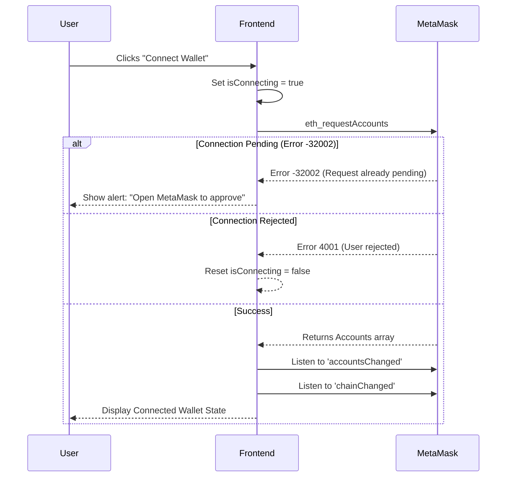
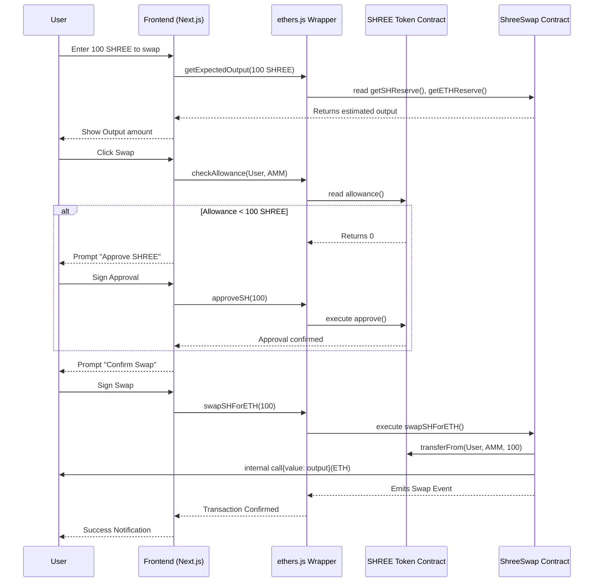
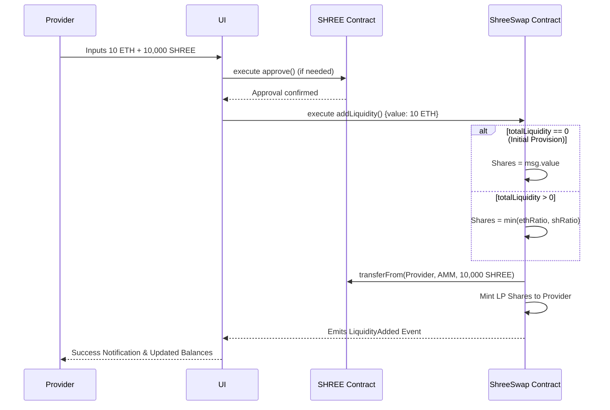

# SHREE SWAP Architecture Specification

This document details the internal architecture, component interactions, and execution flows within the SHREE SWAP decentralized exchange.

## 1. Top-Level Design

The application is structured as a strict three-tier monorepo:

- **`frontend/`**: The Next.js application containing the UI logic, state management, and the integrated `lib/blockchain/` utility layer that communicates directly with MetaMask and the Ethereum Sepolia RPC via `ethers.js`.
- **`backend/`**: A reserved placeholder directory. Currently, there is no centralized backend server. All persistent state is managed on-chain.
- **`blocknode/`**: The Hardhat development environment containing the Solidity smart contracts, compilation artifacts, and deployment scripts.

## 2. Core Operational Flows

### 2.1 Wallet Connection Sequence

The wallet connection procedure includes safeguards to prevent duplicate requests and handle MetaMask state errors gracefully.

### 2.2 Swap Transaction Sequence (SHREE -> ETH)

When a user trades their SHREE tokens for ETH, the system requires two transactions if the AMM contract does not already have an adequate allowance.

### 2.3 Liquidity Provision Sequence

Adding liquidity establishes the pricing ratio and mints liquidity pool (LP) shares to the provider.

## 3. Mathematical Specifications

### Swap Execution
The AMM operates on the constant product formula: $x \times y = k$.
To account for the `0.3%` fee, the exact integer math implemented in Solidity is:
$$Output = \frac{Input \times 997 \times OutputReserve}{(InputReserve \times 1000) + (Input \times 997)}$$

### Liquidity Shares
For secondary liquidity providers, LP shares are minted proportionally to the reserves they add to the pool. To prevent dilution attacks, the contract takes the minimum ratio of the two assets deposited:
$$Shares = \min\left(\frac{Input_{ETH} \times TotalShares}{Reserve_{ETH}}, \frac{Input_{SHREE} \times TotalShares}{Reserve_{SHREE}}\right)$$

## 4. Contract State Management

### Reentrancy Protection
The `ShreeSwap.sol` contract extensively utilizes OpenZeppelin's `ReentrancyGuard`. The `nonReentrant` modifier is applied to:
- `addLiquidity`
- `removeLiquidity`
- `swapSHForETH`
- `swapETHForSH`

This prevents cross-function reentrancy attacks, specifically protecting the `call{value: ...}("")` invocations when sending ETH back to users.
